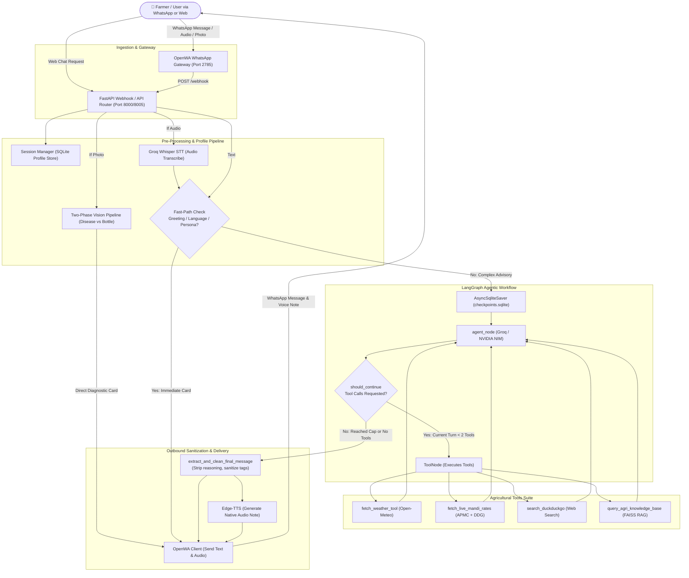

# 🌾 FarmAssist: Complete Technical Specification & AI System Reference

> **Document Purpose:**  
> This document serves as the single source of truth for **FarmAssist**. It provides an A-to-Z technical blueprint for human software engineers, agronomists, and AI coding assistants (LLMs) to understand, maintain, debug, and extend the system without breaking architectural invariants.

---

## 1. Executive Summary & Mission

**FarmAssist** is an enterprise-grade AI Agronomist and **"Krishi Mitra"** designed to empower Indian farmers with real-time, hyperlocal agricultural advisory over **WhatsApp** and **Web interfaces**. 

The system operates in **4 core Indian languages** (**English**, **മലയാളം (Malayalam)**, **हिन्दी (Hindi)**, and **தமிழ் (Tamil)**) and provides:
1. **Multimodal Plant Health & Agro-Chemical Vision:** Classifies whether a farmer uploaded a diseased crop leaf or a pesticide/insecticide bottle. Delivers ICAR/PPQS/CIBRC-verified active ingredient dosages, target pests, and waiting periods (PHI).
2. **Hyperlocal Weather & Smart Spray Windows:** Integrates Open-Meteo telemetry to provide temperature, rain chance, wind speed, surface soil moisture, and safe chemical spray windows.
3. **Real-time APMC Mandi Rates & Market Intelligence:** Delivers modal prices and price bands (₹/Quintal and ₹/kg) for major commercial crops across Indian mandis with live search fallbacks.
4. **Natural Voice Interaction (STT & TTS):** Transcribes rural voice notes via Whisper and synthesizes spoken replies via Microsoft Edge-TTS with regional Indian neural voices.
5. **Government Schemes & RAG Advisory:** Semantic search over ICAR packages of practice, PM-KISAN, PMFBY crop insurance, and state horticulture subsidies via FAISS.

---

## 2. Complete Technology Stack

| Layer | Technologies / Libraries | Purpose |
|---|---|---|
| **Core Runtime** | Python 3.11-slim, AsyncIO | High-concurrency asynchronous backend |
| **API Framework** | FastAPI `0.111.0`, Uvicorn `0.30.1`, Pydantic Settings | Webhook handling, REST endpoints, async lifecycle |
| **Agent Orchestration** | LangGraph `1.1.6`, LangChain Core `0.3.x` | Cyclical graph workflow, state routing, tool nodes |
| **State Persistence** | `langgraph-checkpoint-sqlite`, SQLite3 | Persistent multi-turn conversation memory (24h TTL) |
| **Primary LLM** | Groq Cloud (`langchain-groq`), `openai/gpt-oss-120b` | High-reasoning agricultural reasoning and tool calling |
| **Fallback LLMs** | NVIDIA NIM API (`langchain-openai`), `meta/llama-3.2-11b-vision-instruct`, `openai/gpt-oss-20b` | Circuit breaker failover for Groq rate limits (429) & timeouts |
| **Computer Vision** | NVIDIA NIM / Groq Vision (`meta/llama-3.2-11b-vision-instruct`) | Leaf disease diagnosis, pesticide bottle OCR & validation |
| **Speech-to-Text (STT)** | Groq Whisper API (`whisper-large-v3` / `turbo`) | Transcribing voice notes across Indian languages |
| **Text-to-Speech (TTS)** | Microsoft Edge-TTS (`edge-tts`) | Natural regional Indian neural voice note generation |
| **RAG & Vector Search** | FAISS (`faiss-cpu`), FastEmbed, LangChain Community | In-memory semantic search over ICAR & government advisories |
| **Live Web Search** | Resilient 4-tier pipeline (`lite.duckduckgo.com`, `html.duckduckgo.com`, Google News India RSS, `ddgs`) | Zero-timeout real-time APMC mandi news and agricultural updates |
| **WhatsApp Gateway** | Dockerized OpenWA (`rmyndharis/openwa:latest`) | WhatsApp Web automation, webhook delivery, media transfer |
| **Containerization** | Docker, Docker Compose | Multi-container architecture (`fastapi-bot`, `openwa-gateway`) |

---

## 3. Comprehensive AI & ML Model Inventory

### 3.1 Primary Conversational & Reasoning Engine
- **Model Identifier:** `openai/gpt-oss-120b` (hosted via Groq API)
- **Role:** Central agronomist reasoning agent. Evaluates user intent, binds tools, interprets soil/weather/price data, and synthesizes empathetic, practical agricultural advice.
- **Key Characteristics:** Generates intermediate `reasoning_content` (chain-of-thought) before tool calls or final outputs.
- **Critical Architectural Rule:** `reasoning_content` is **internal only** and must **NEVER** be leaked to WhatsApp or Web users.

### 3.2 High-Reliability Fallback Engine
- **Model Identifiers:**
  1. Primary Fallback: `meta/llama-3.2-11b-vision-instruct` (NVIDIA NIM)
  2. Secondary Backup: `openai/gpt-oss-20b` (NVIDIA NIM)
- **Role:** Activated automatically when Groq returns HTTP 429 (Rate Limit), token exhaustion, or timeout (> 20s). Includes a 10-minute circuit breaker to protect latency.

### 3.3 Multimodal Vision & OCR Engine
- **Model Identifier:** `meta/llama-3.2-11b-vision-instruct` (NVIDIA NIM / Groq Vision)
- **Role:** Two-phase computer vision pipeline:
  - **Phase 1 (Visual Classification):** Determines whether the image is:
    - `DISEASED_PLANT`: Leaf symptoms, blight, fungal spots, insect attacks, nutrient deficiencies.
    - `PESTICIDE_OR_CHEMICAL`: Insecticide bottles, fungicide packets, weedicide labels, fertilizer bags.
    - `HEALTHY_PLANT` or `OTHER`.
  - **Phase 2 (Agricultural Diagnosis & Safety Matching):**
    - For Plant Diseases: Identifies pathogen/deficiency, provides organic remedies, chemical treatments, and preventive farming practices.
    - For Chemical Bottles: Extracts brand name and active chemical ingredient, cross-references against the local **CIBRC & PPQS dataset** (`app/services/agrochemical_db.py`), verifies authorized dosage per acre/liter, and enforces strict waiting periods (PHI).

### 3.4 Speech-to-Text (STT) Engine
- **Model Identifier:** Groq Whisper (`whisper-large-v3` / `whisper-large-v3-turbo`)
- **Role:** Converts incoming WhatsApp audio notes (.ogg, .mp3, .wav, .m4a) to text. Auto-detects language scripts (Devanagari, Malayalam, Tamil, Latin) for downstream language setting.

### 3.5 Text-to-Speech (TTS) Indian Neural Voices
- **Engine:** Microsoft Edge-TTS
- **Voice Mapping:**
  - **Malayalam (`ml-IN`):** `ml-IN-SobhanaNeural` (Female), `ml-IN-MidhunNeural` (Male)
  - **Hindi (`hi-IN`):** `hi-IN-SwaraNeural` (Female), `hi-IN-MadhurNeural` (Male)
  - **Tamil (`ta-IN`):** `ta-IN-PallaviNeural` (Female), `ta-IN-ValluvarNeural` (Male)
  - **English (India - `en-IN`):** `en-IN-NeerjaNeural` (Female), `en-IN-PrabhatNeural` (Male)
- **Text Pre-Processing:** Cleaned by `app/services/text_cleaner.py` to strip markdown, citations, emojis, and expand units (`27°C` -> *"27 degrees Celsius"*, `80%` -> *"80 percent"*, `10 km/h` -> *"10 kilometers per hour"*).

### 3.6 Safety & Guardrails
- **Engine:** `check_nvidia_guardrail()` in `app/services/guardrails.py`
- **Role:** Evaluates incoming user prompts against malicious intent, prompt injection, jailbreaks, and off-topic queries (politics, gaming, entertainment). Politely redirects off-topic questions back to agriculture.

---

## 4. System Architecture & Workflow

### 4.1 End-to-End Architectural Diagram



---

## 5. LangGraph Agent Workflow Details

### 5.1 State Machine Graph
- **State Definition:** `AgentState` containing:
  - `messages`: List of LangChain `BaseMessage` objects (`HumanMessage`, `AIMessage`, `ToolMessage`, `SystemMessage`).
  - `user_language`: Explicit or auto-detected language (`English`, `Malayalam`, `Hindi`, `Tamil`).
  - `user_lat` / `user_lon`: Saved GPS coordinates.
  - `sender_phone`: WhatsApp ID or Web Client ID.

### 5.2 Zero-Latency Fast-Paths
Before invoking expensive LLM calls, `agent_node` executes lightweight regex and pattern matching fast-paths:
1. **Help & Krishi Mitra Persona Fast Path (`is_help_or_persona_query`):** Responds immediately with the 6 core pillars of FarmAssist in the farmer's native language.
2. **Pure Greeting Fast Path (`is_greeting`):** Handles `"hi"`, `"namaste"`, `"halo"`, `"hey bro"` instantly with localized language selection options.
3. **Language Selection Fast Path (`detect_language_choice_fast`):** Instantly updates user profile to Malayalam, Hindi, Tamil, or English and acknowledges the switch.

### 5.3 Turn-Scoped Tool Loop Protection
- In multi-turn chats, message history accumulates in SQLite.
- `app/agent/graph.py` enforces a **turn-scoped tool execution limit**:
  - Only `ToolMessage`s occurring **after the last `HumanMessage`** are counted.
  - When `current_turn_tool_msgs >= 2`, the agent node invokes the LLM **without tools** (`llm` instead of `llm_with_tools`).
  - This mathematically guarantees that the model cannot loop infinitely and is forced to synthesize a human-readable text answer using available data.

### 5.4 Output Sanitization Invariant
- **File:** `app/main.py` -> `extract_and_clean_final_message()`
- **Rule:** 
  1. Searches backward for `AIMessage`.
  2. Skips intermediate tool call messages (`getattr(msg, "tool_calls", None)`).
  3. Never accesses `reasoning_content` or leaks `<think>` scratchpads.
  4. Returns sanitized, user-facing markdown text.

---

## 6. Agricultural Tools Suite

### 6.1 `fetch_weather_tool` (`app/tools/weather.py`)
- **API Source:** Open-Meteo Weather Forecast API & Geocoding API.
- **Inputs:** `location_name` (e.g. *"Thrissur"*, *"Kolar"*), or latitude/longitude coordinates.
- **Outputs:**
  - Current temperature (°C), relative humidity (%), surface soil moisture (0-7cm m³/m³), wind speed (km/h), rain precipitation.
  - 3-day hyperlocal forecast breakdown.
  - Safe pesticide/fertilizer spraying windows (flags high winds > 15 km/h or imminent rain > 1mm).

### 6.2 `fetch_live_mandi_rates` (`app/tools/mandi_rates.py`)
- **Benchmark Database:** Curated APMC modal price records for:
  - **Vegetables:** Tomato, Potato, Onion, Green Chilli, Cabbage, Carrot, Radish, Beetroot, Spinach, Peas.
  - **Cereals & Pulses:** Paddy/Rice, Wheat, Maize, Cotton, Soybean.
  - **Plantation & Cash Crops:** Banana (Robusta & Nendran), Coconut & Copra, Black Pepper, Tapioca / Cassava, Ginger, Turmeric.
- **Regional Intelligence:** Automatically adapts benchmark crop priorities for South India / Kerala (highlights Nendran, Coconut, Pepper, Tapioca).
- **Live Search Fallback:** Uses DuckDuckGo search to retrieve real-time APMC trade news snippets when prices fluctuate.

### 6.3 `search_duckduckgo` (`app/tools/web_search.py`)
- **Engine:** `duckduckgo_search` / `ddgs` with resilient HTML scraper fallback.
- **Usage:** Used when queries pertain to breaking agricultural news, newly emerging pests, or hyper-specific regional seed varieties.

### 6.4 `query_agri_knowledge_base` (`app/tools/rag_tool.py`)
- **Engine:** In-memory FAISS vector index with FastEmbed embeddings.
- **Pre-warmed:** Pre-warmed during application startup (`lifespan`) to eliminate cold-start search latency.
- **Content:** Government schemes (PM-KISAN, PMFBY, PKVY, Subhiksha Keralam) and ICAR standard agronomic practices.

### 6.5 CIBRC & PPQS Chemical Safety Engine (`app/services/agrochemical_db.py`)
- **Standard:** Official Government of India **Central Insecticides Board & Registration Committee (CIBRC)** and **Directorate of Plant Protection, Quarantine & Storage (PPQS)** standards.
- **Database:** Contains verified formulations:
  - *Chlorantraniliprole 18.5% SC (Coragen)*
  - *Imidacloprid 17.8% SL (Confidor)*
  - *Emamectin Benzoate 5% SG (Proclaim)*
  - *Mancozeb 75% WP (Dithane M-45)*
  - *Azoxystrobin 18.2% + Difenoconazole 11.4% SC (Amistar Top)*
  - *Glyphosate 41% SL, Pretilachlor 50% EC, Cartap Hydrochloride, etc.*
- **Safety Rule:** Every diagnosis provides:
  1. What it is / target pests
  2. Recommended dosage per liter / per acre
  3. Safe spray timing and Waiting Period (PHI - Pre-Harvest Interval) in days.

---

## 7. Directory Structure & File Map

```
FarmAssist/
├── app/
│   ├── __init__.py
│   ├── config.py                 # Pydantic BaseSettings (.env loader, API keys, paths)
│   ├── main.py                   # FastAPI app, lifespan, /webhook, /api/chat, message sanitizer
│   │
│   ├── agent/
│   │   ├── __init__.py
│   │   └── graph.py              # LangGraph workflow, agent_node, routing, system prompts, fast paths
│   │
│   ├── services/
│   │   ├── __init__.py
│   │   ├── agrochemical_db.py    # CIBRC / PPQS verified pesticide & chemical database
│   │   ├── guardrails.py         # NVIDIA NeMo / safety prompt injection & off-topic guardrails
│   │   ├── openwa_client.py      # Async HTTP client for OpenWA WhatsApp REST API
│   │   ├── session_manager.py    # Persistent SQLite profiles (locations, languages, session TTL)
│   │   ├── stt.py                # Groq Whisper Speech-to-Text handler
│   │   ├── text_cleaner.py       # Regex cleaner: strips <think> tags, expands units for TTS
│   │   ├── tts.py                # Microsoft Edge-TTS audio generator for Indian languages
│   │   └── vision_service.py     # Multimodal vision analyzer (disease diagnosis vs chemical bottle OCR)
│   │
│   └── tools/
│       ├── __init__.py
│       ├── mandi_rates.py        # APMC mandi rates benchmark cache & DuckDuckGo trade search
│       ├── rag_tool.py           # FAISS vector store for ICAR agronomy & government schemes
│       ├── weather.py            # Open-Meteo weather telemetry, soil moisture & spray windows
│       └── web_search.py         # DuckDuckGo agricultural web search engine
│
├── data/
│   ├── checkpoints.sqlite        # SQLite checkpoint database for LangGraph multi-turn states
│   └── locations.json            # Cached reverse-geocoded coordinates & user locations
│
├── tests/
│   ├── test_fixes.py             # Unit tests for text cleaners, language persistence, sanitizer
│   ├── test_flow.py              # API endpoint integration tests
│   ├── test_new_features.py      # Tool validation tests
│   └── test_nvidia_fallback.py   # NVIDIA NIM circuit-breaker fallback verification
│
├── Dockerfile                    # Python 3.11-slim container with ffmpeg and dependencies
├── docker-compose.yml            # Multi-service composition (fastapi-bot + openwa-gateway)
├── requirements.txt              # Production Python package requirements
├── start-demo.bat                # Windows startup batch script for local testing
└── PROJECT_OVERVIEW.md           # Master technical reference document (This file)
```

---

## 8. Configuration & Environment Variables Reference

| Variable Name | Default Value | Description |
|---|---|---|
| `GROQ_API_KEY` | *(Required)* | API Key for Groq Cloud (runs primary LLM & Whisper STT) |
| `LLM_MODEL` | `openai/gpt-oss-120b` | Primary conversational model on Groq |
| `NVIDIA_API_KEY` / `NVDIA_API_KEY` | *(Optional)* | API Key for NVIDIA NIM high-availability fallback & vision |
| `NVIDIA_MODEL` | `openai/gpt-oss-20b` | Fallback text model on NVIDIA NIM |
| `NVIDIA_BASE_URL` | `https://integrate.api.nvidia.com/v1` | Base URL for NVIDIA OpenAI-compatible API |
| `OPENWA_API_URL` | `http://openwa-gateway:2785` | Internal Docker / local URL for OpenWA gateway |
| `OPENWA_API_KEY` | `owa_k1_...` | Secure bearer token for OpenWA REST API |
| `OPENWA_SESSION_ID` | `108660cd-...` | Unique WhatsApp Web session identifier |
| `DB_PATH` | `/app/data/checkpoints.sqlite` | SQLite file path for LangGraph checkpoints |
| `LOCATIONS_DB_PATH` | `/app/data/locations.json` | JSON storage for saved user GPS coordinates |
| `SESSION_TTL_SECONDS` | `86400` (24 Hours) | Multi-turn chat session memory duration |
| `ALLOW_GROUP_MESSAGES` | `false` | When false, ignores messages from WhatsApp groups (`@g.us`) and responds only to DMs |
| `DEFAULT_LAT` | `10.6541474` | Default fallback latitude (Kerala / Palakkad / Thrissur) |
| `DEFAULT_LON` | `76.7359742` | Default fallback longitude |
| `DEFAULT_VOICE` | `en-IN-NeerjaNeural` | Default Edge-TTS voice identifier |

---

## 9. Developer & AI Assistant Operational Guidelines

### 9.1 Invariant Rules for AI Coding Assistants (LLMs)
When working on this codebase, **YOU MUST ADHERE TO THE FOLLOWING INVARIANTS**:

1. **NEVER Leak Internal Reasoning (`reasoning_content`):**
   Models like `openai/gpt-oss-120b` produce internal chain-of-thought in `additional_kwargs["reasoning_content"]`. Under **no circumstances** should this string be returned to users. `extract_and_clean_final_message()` in `app/main.py` must strictly extract assistant text from `msg.content` and skip tool-calling intermediate messages.

2. **Preserve Turn-Scoped Tool Counting:**
   In `app/agent/graph.py`, always count `ToolMessage`s **after the last `HumanMessage`**. Counting across all messages in state will brick tool execution in multi-turn chats after turn 2.

3. **Never Fabricate Chemical Dosages:**
   All chemical remedies must adhere to the formulations in `app/services/agrochemical_db.py` (CIBRC / PPQS). If a chemical is not in the database, advise the farmer to check the physical label and consult the local **Krishi Vigyan Kendra (KVK)** or Kisan Call Center (**1800-180-1551**).

4. **Keep First Responses Farmer-Friendly:**
   Initial responses must be concise, structured with bullet points, and highlight:
   - 🎯 What it is / what to use
   - 💧 Exact dilution dose (e.g. *2 ml per liter of water*)
   - ⏰ When / how to apply
   Avoid overwhelming farmers with academic jargon unless they explicitly ask for detailed chemistry or scientific mode of action.

5. **Edge-TTS Audio Sanitization:**
   Whenever modifying text before speech synthesis, always pass it through `clean_text_for_speech()` in `app/services/text_cleaner.py`. Never let raw markdown (`**`, `###`), citations (`[Source: ...]`), or raw units (`°C`, `km/h`) be read verbatim by the TTS engine.

6. **Fast-Paths Must Bypass the LLM:**
   Simple greetings and language selections must be resolved in 0 milliseconds using the regex fast-paths in `agent_node`. Do not remove or degrade these fast-paths.

7. **Clean WhatsApp Formatting & HTML Tag Removal:**
   Never emit raw HTML tags (`<br>`, `<p>`, `<b>`, `<div>`) or broken list asterisks (`* bullet`) that conflict with WhatsApp `*bold*` markdown. All web snippets and outgoing text must pass through `clean_response_text()` and `clean_search_snippet()` in [`app/services/text_cleaner.py`](file:///e:/Farmassist/FarmAssist/app/services/text_cleaner.py), normalizing list items to clean bullet characters (`• `) and standard newlines (`\n`).

---

## 10. Verification & Quality Assurance Commands

### 10.1 Running Test Suites Inside Docker
```bash
# Run unit test suite
docker exec farmassist-fastapi-bot-1 bash -c "PYTHONPATH=/app pytest tests/test_fixes.py"

# Run end-to-end multi-turn conversation test
docker exec farmassist-fastapi-bot-1 python /app/scratch/test_turn1.py
```

### 10.2 Inspecting Live Logs
```bash
# View last 100 log lines from the FastAPI bot
docker logs --tail 100 farmassist-fastapi-bot-1

# View OpenWA WhatsApp gateway logs
docker logs --tail 100 farmassist-openwa-gateway-1
```

### 10.3 Deploying Code Updates to Container
```bash
# Copy modified code directly into container without rebuild
docker cp app/main.py farmassist-fastapi-bot-1:/app/app/main.py
docker cp app/agent/graph.py farmassist-fastapi-bot-1:/app/agent/graph.py
docker cp app/tools/mandi_rates.py farmassist-fastapi-bot-1:/app/tools/mandi_rates.py

# Restart container to reload Python modules
docker restart farmassist-fastapi-bot-1
```
